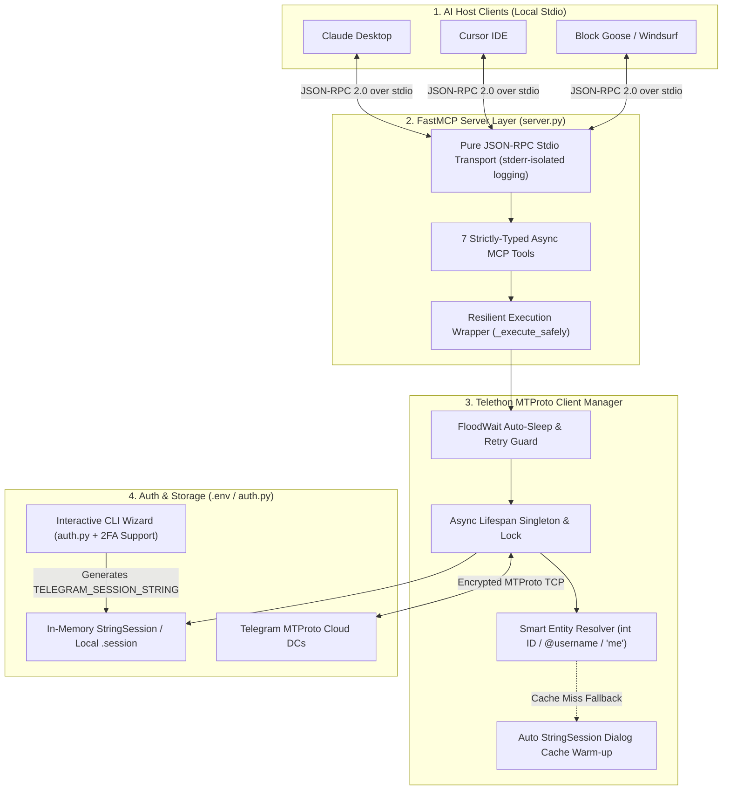

<div align="center">

# ✈️ Telegram User MCP

**Production-Grade Model Context Protocol (MCP) Server for Full Personal Telegram Account (Userbot / MTProto) Control via Telethon & FastMCP**

[🇺🇸 English](README.md) | [🇷🇺 Русский](README.ru.md) | [🇨🇳 中文](README.zh-CN.md)

[Overview](#-overview) &nbsp;•&nbsp; [System Architecture](#-system-architecture) &nbsp;•&nbsp; [MCP Tools](#-mcp-tools-reference) &nbsp;•&nbsp; [Quick Start](#-quick-start) &nbsp;•&nbsp; [Configuration](#-mcp-client-configuration)

<br/>

[](https://github.com/oladikezz/telegram-user-mcp)
[](https://www.python.org/)
[](https://modelcontextprotocol.io/)
[](https://docs.telethon.dev/)
[](https://claude.ai/download)
[](LICENSE)

</div>

---

## 🇺🇸 Overview

**Telegram User MCP** is a high-performance, asynchronous **Model Context Protocol (MCP)** server engineered in Python using **FastMCP** and **Telethon**. Unlike standard Bot API integrations that are restricted to bot accounts and limited group visibility, **Telegram User MCP** connects directly to Telegram's native **MTProto API** on behalf of a personal user account (Userbot).

This grants AI assistants (**Claude Desktop**, **Cursor**, **Goose**, **Windsurf**) seamless, structured access to your personal chats, private groups, channels, saved messages, global search, and message management over local `stdio` with zero third-party cloud relays.

---

## 🧠 System Architecture

**Telegram User MCP** enforces strict separation between **JSON-RPC Stdio Transport**, **Resilient Error & Rate-Limit Middleware**, **Entity Resolution & Peer Cache**, and **MTProto Session Management**.



---

## ✨ Key Features

- 🔐 **Native Personal Account Control (MTProto):** Full access to personal dialogs, archived folders, private supergroups, channels, and Saved Messages (`me`).
- 🛡️ **Zero Stdio Pollution:** All server and Telethon diagnostic logs are strictly routed to `sys.stderr`, guaranteeing 100% corruption-free JSON-RPC 2.0 communication over `stdout`.
- ⚡ **Smart `StringSession` Entity Resolution:** Automatically resolves numeric peer IDs (`-100...`, `12345678`), stringified numbers, `@usernames`, and `'me'`. Includes automatic dialog cache warm-up when `access_hash` entries are cold in `StringSession`.
- ⏱️ **Adaptive `FloodWaitError` Recovery:** Automatically sleeps and retries transient rate limits (up to `TELEGRAM_MAX_FLOOD_WAIT_SLEEP=15s`) while returning structured retry telemetry for longer blocks without crashing the server.
- 🔑 **One-Time Interactive 2FA Auth Wizard (`auth.py`):** Standalone CLI utility supporting SMS/App codes and hidden cloud 2FA passwords (`getpass`), automatically exporting `TELEGRAM_SESSION_STRING` directly into `.env`.
- 🧱 **Strict Pydantic Validation & Typing:** Comprehensive parameter bounds checking (`limit`, `offset_id`, `folder`, `message_id`) and structured JSON schemas for reliable LLM tool calling.

---

## 🧰 MCP Tools Reference

| Tool Name | Signature | Description | Key Returned Fields |
| :--- | :--- | :--- | :--- |
| **`list_dialogs`** | `(limit: int = 20, folder: Optional[int] = None)` | Lists active chats, private dialogs, groups, and channels (`folder=0` main, `1` archive). | `id`, `name`, `username`, `type`, `unread_count`, `pinned`, `last_message_preview` |
| **`get_chat_history`** | `(chat_id: int \| str, limit: int = 30, offset_id: int = 0)` | Fetches recent messages from any chat with pagination support. | `id`, `sender_id`, `sender_name`, `date`, `text`, `has_media`, `media_type`, `reply_to` |
| **`search_messages`** | `(query: str, chat_id: Optional[int \| str] = None, limit: int = 20)` | Performs global search across all dialogs (`chat_id=None`) or inside a specific chat. | `query`, `scope`, `chat_id`, `chat_name`, `id`, `sender_name`, `date`, `text` |
| **`send_message`** | `(chat_id: int \| str, text: str, reply_to_msg_id: Optional[int] = None)` | Sends a new text message or replies to a specific message ID. | `ok`, `chat_id`, `message` (`id`, `date`, `text`, `reply_to_msg_id`) |
| **`edit_message`** | `(chat_id: int \| str, message_id: int, new_text: str)` | Edits an existing message sent by the authenticated user. | `ok`, `chat_id`, `message` (`id`, `text`, `edit_date`) |
| **`mark_as_read`** | `(chat_id: int \| str, max_id: Optional[int] = None)` | Acknowledges unread messages, mentions, and reactions in a chat. | `ok`, `chat_id`, `max_id`, `status` |
| **`get_user_info`** | `(user_id: int \| str)` | Retrieves full user profile via `GetFullUserRequest`. | `id`, `full_name`, `username`, `active_usernames`, `phone`, `bio`, `status`, `is_premium`, `common_chats_count` |

---

## 🛡️ Fault Tolerance & Error Handling Matrix

| Telegram / Runtime Exception | Server Behavior | Crash Free? |
| :--- | :--- | :--- |
| `FloodWaitError (<= 15s)` | Automatically awaits `e.seconds + 1` and retries the request once transparently. | ✅ Yes |
| `FloodWaitError (> 15s)` | Returns `{"ok": false, "error_type": "FloodWaitError", "retry_after_seconds": N}` immediately. | ✅ Yes |
| `AuthKeyUnregisteredError` / `UnauthorizedError` | Returns actionable instruction to regenerate session via `python auth.py`. | ✅ Yes |
| `ValueError` (Unseen `int` ID in `StringSession`) | Triggers automatic `client.get_dialogs(limit=200)` cache warm-up and retries `get_entity`. | ✅ Yes |
| `MessageNotModifiedError` | Gracefully returns `{"ok": true, "warning": "MessageNotModifiedError"}`. | ✅ Yes |
| `ChatWriteForbiddenError` / `ChannelPrivateError` | Returns structured permission error to the LLM without interrupting the session. | ✅ Yes |

---

## 🚀 Quick Start

### 1. Prerequisites
- **Python 3.10+** (or [uv](https://docs.astral.sh/uv/) package manager)
- Telegram API credentials (`API_ID` and `API_HASH`) from [https://my.telegram.org/apps](https://my.telegram.org/apps)

### 2. Installation

```bash
# Clone the repository
git clone https://github.com/oladikezz/telegram-user-mcp.git
cd telegram-user-mcp

# Option A: Using uv (Recommended)
uv venv
uv pip install -r requirements.txt

# Option B: Using standard venv + pip
python -m venv .venv
.venv\Scripts\activate   # Windows
# source .venv/bin/activate  # macOS / Linux
pip install -r requirements.txt
```

### 3. Authenticate & Generate `TELEGRAM_SESSION_STRING`

Copy `.env.example` to `.env` (or let `auth.py` prompt you interactively):

```bash
cp .env.example .env
python auth.py
```

`auth.py` will ask for your phone number, the login code sent via Telegram/SMS, and your 2FA cloud password (if enabled), then automatically write `TELEGRAM_SESSION_STRING` to `.env`.

---

## ⚙️ MCP Client Configuration

Add the server to your **`claude_desktop_config.json`** (Claude Desktop) or **`.cursor/mcp.json`** (Cursor IDE):

### Option A: Launch via `uv` (Recommended)

```json
{
  "mcpServers": {
    "telegram-user": {
      "command": "uv",
      "args": [
        "run",
        "--directory",
        "C:/Users/user/Desktop/telegram-user-mcp",
        "--with",
        "mcp[cli]",
        "--with",
        "telethon",
        "--with",
        "python-dotenv",
        "python",
        "server.py"
      ],
      "env": {
        "TELEGRAM_API_ID": "12345678",
        "TELEGRAM_API_HASH": "your_api_hash_here",
        "TELEGRAM_SESSION_STRING": "your_session_string_from_auth_py"
      }
    }
  }
}
```

### Option B: Launch via Direct Virtual Environment Python

```json
{
  "mcpServers": {
    "telegram-user": {
      "command": "C:/Users/user/Desktop/telegram-user-mcp/.venv/Scripts/python.exe",
      "args": [
        "C:/Users/user/Desktop/telegram-user-mcp/server.py"
      ]
    }
  }
}
```

---

## 📁 Project Structure

```text
telegram-user-mcp/
├── auth.py                      # Interactive CLI wizard for 2FA auth & StringSession generation
├── server.py                    # FastMCP stdio server with 7 Telethon userbot tools
├── requirements.txt             # Python dependencies (mcp[cli], telethon, python-dotenv, cryptg)
├── claude_desktop_config.json   # Ready-to-use configuration template for Claude / Cursor
├── .env.example                 # Environment variables template
├── .gitignore                   # Protects .env and *.session files from Git tracking
├── README.md                    # Documentation (English)
├── README.ru.md                 # Documentation (Russian)
└── README.zh-CN.md              # Documentation (Chinese)
```

---

<br/>

## 🇷🇺 Русский

> Полная документация на русском языке доступна в [README.ru.md](README.ru.md).

**Telegram User MCP** — это готовый к продакшену асинхронный MCP-сервер на Python (**FastMCP** + **Telethon**), предоставляющий ИИ-ассистентам (**Claude Desktop**, **Cursor**, **Goose**) прямой доступ к личному аккаунту Telegram по протоколу **MTProto**.

### Основные возможности:
- **Полный набор из 7 инструментов**: `list_dialogs`, `get_chat_history`, `search_messages`, `send_message`, `edit_message`, `mark_as_read`, `get_user_info`.
- **Одноразовый CLI-авторизатор (`auth.py`)**: поддержка кода подтверждения, облачного пароля 2FA и автосохранения `TELEGRAM_SESSION_STRING` в `.env`.
- **Устойчивость к сбоям**: автоматический прогрев кэша диалогов для `StringSession`, авто-ожидание коротких `FloodWaitError` и строгая изоляция логов в `stderr`.

---

<br/>

## 🇨🇳 中文

> 完整中文文档请参阅 [README.zh-CN.md](README.zh-CN.md)。

**Telegram User MCP** 是一个基于 Python（**FastMCP** 与 **Telethon**）构建的生产级 **Model Context Protocol (MCP)** 服务器，允许 AI 助手（**Claude Desktop**、**Cursor**、**Goose**）通过原生 **MTProto** 协议安全地控制您的个人 Telegram 账号（Userbot）。
